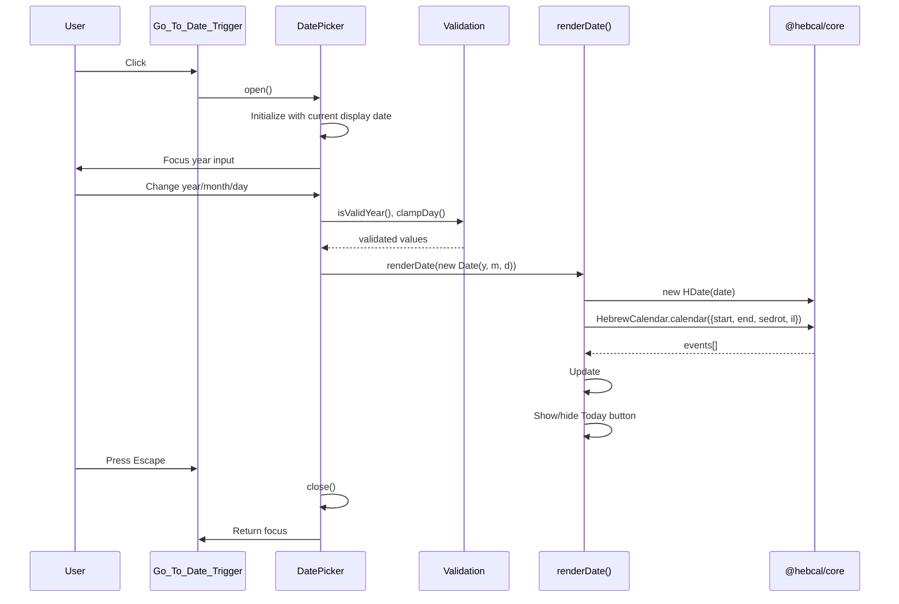

# Design Document: Go to Date

## Overview

The "Go to Date" feature adds a date picker to the Hebrew Date & Parsha site, allowing users to navigate to any Gregorian date (1 CE–9999 CE) and view the corresponding Hebrew date, weekly parsha, and holidays. The feature integrates into the existing dark/gold card-based UI using vanilla JavaScript and the already-imported `@hebcal/core` library.

### Key Design Decisions

1. **Custom dropdown date picker** — three controls (year text input, month `<select>`, day `<select>`) rather than native `<input type="date">`. This gives full styling control, supports the 1–9999 CE range, and provides consistent cross-browser behavior matching the site's aesthetic.
2. **Live update on valid selection** — the Info_Display updates immediately when all three fields form a valid date, with no separate "Go" button needed. This provides a fluid exploration experience.
3. **Shared `renderDate(date)` function** — extracted from the current `init()` logic. Both "today" and "go-to-date" flows share a single rendering code path, eliminating duplication and reducing risk of display inconsistencies.
4. **No framework, single-file approach** — consistent with the existing architecture. All logic stays in `main.js` with clearly separated functions.
5. **All CSS added inline in `index.html`** — consistent with the existing approach where all styles are in the `<style>` tag.

## Architecture

```mermaid
graph TD
    A[User Interaction] --> B{Action Type}
    B -->|Click Trigger| C[Toggle DatePicker]
    B -->|Change Date Fields| D[Validate & Render]
    B -->|Click Today| E[renderDate - today]
    B -->|Page Load| F[renderDate - today]
    
    C -->|Open| G[Show Picker Overlay]
    C -->|Close| H[Hide Picker Overlay]
    
    D --> I[isValidYear + clampDay]
    I -->|Valid| J[renderDate - selected]
    I -->|Invalid| K[Reject / Retain Previous]
    
    J --> L[@hebcal/core]
    E --> L
    F --> L
    
    L --> M[HDate constructor]
    L --> N[HebrewCalendar.calendar]
    
    M --> O[Hebrew date strings]
    N --> P[Parsha + Holiday events]
    
    O --> Q[Update #main innerHTML]
    P --> Q
    
    Q --> R{Date == Today?}
    R -->|Yes| S[Hide Today Button]
    R -->|No| T[Show Today Button]
```

### Component Interaction Flow



## Components and Interfaces

### 1. `renderDate(gregDate: Date): void`

Extracted from the current `init()` logic. Accepts a Gregorian `Date` object and:
1. Creates an `HDate` from it
2. Queries `HebrewCalendar.calendar()` with `{start: hd, end: endDate, sedrot: true, il: true}` to find the next parsha (looking forward up to 7 days to reach the next Shabbat)
3. Filters holidays for the given date specifically
4. Updates `#main` innerHTML with formatted output (Hebrew date EN/HE, Gregorian date, holidays, parsha)
5. Shows/hides the "Today" button based on whether `gregDate` is the same calendar day as today
6. Updates the module-level `currentDisplayDate` on success
7. Wraps the @hebcal/core calls in try/catch for out-of-range dates

**Error Handling:**
- If HDate construction throws (unsupported date range), displays an error message in `#main`
- On error, retains `currentDisplayDate` unchanged

### 2. DatePicker Component

A DOM-based component created programmatically and appended as a sibling to the trigger button, absolutely positioned as an overlay.

**Public Interface:**
```javascript
function createDatePicker(triggerEl) → { open(), close(), isOpen(), getElement() }
```

**Internal DOM Structure:**
```
div.date-picker [role="dialog"][aria-label="Date picker"]
├── label + input.dp-year [type="text"][aria-label="Year"][inputmode="numeric"]
├── label + select.dp-month [aria-label="Month"]
│   └── option × 12 (January–December)
└── label + select.dp-day [aria-label="Day"]
    └── option × N (rebuilt dynamically based on month/year)
```

**Behavior:**
- Year input: text field accepting integers 1–9999. Validated on `change`/`blur`. If invalid, reverts to previous valid value.
- Month select: standard `<select>` with 12 options showing full month names.
- Day select: options rebuilt via `updateDayOptions()` when month or year changes. If current day exceeds new max, clamps down.
- On any change that produces a valid complete date, calls `renderDate()` immediately.

### 3. Go_To_Date_Trigger Button

A `<button>` element injected into the card between the date/holiday section and the parsha divider.

**Attributes:**
- `aria-expanded="false"` (toggled to `"true"` when picker is open)
- `aria-haspopup="dialog"`
- Accessible text: "Go to date" (via button text content)
- Class: `go-to-date-btn`

**Styling:** Uses `--gold`, `--card`, `--text`, `--radius` CSS custom properties. 1px border with `rgba(201, 168, 76, 0.28)` — same opacity as the card border.

### 4. Today Button

A `<button>` element shown only when the displayed date ≠ today. Positioned near the trigger button area (below it, within the card).

**Behavior:**
- On click: calls `renderDate(new Date())`
- Visibility controlled by comparing `currentDisplayDate` to today's date (year, month, day match)
- On render failure: displays error message, retains previous date display

### 5. Validation Functions (Pure)

```javascript
/**
 * Returns the number of days in a given Gregorian month/year.
 * @param {number} year - Gregorian year (1–9999)
 * @param {number} month - 0-indexed month (0=January, 11=December)
 * @returns {number} Days in that month (28–31)
 */
function daysInMonth(year, month)

/**
 * Clamps a day value to the valid range for the given month/year.
 * @param {number} year - Gregorian year (1–9999)
 * @param {number} month - 0-indexed month
 * @param {number} day - 1-indexed day (may exceed valid range)
 * @returns {number} Clamped day in [1, daysInMonth(year, month)]
 */
function clampDay(year, month, day)

/**
 * Validates that a string represents a valid year (integer in [1, 9999]).
 * @param {string} value - User input string
 * @returns {boolean} True if valid
 */
function isValidYear(value)
```

### 6. Focus Management

- **Open:** Focus moves to the year input (first interactive element in picker)
- **Escape:** Closes picker, returns focus to the trigger button
- **Tab/Shift+Tab:** Trapped within the picker while it's open (focus wrapping between first and last focusable elements)
- **Click outside:** Closes the picker (via `mousedown` listener on document)

## Data Models

### Application State

```javascript
// Module-level state
let currentDisplayDate = new Date();  // Date currently shown in Info_Display

// Derived
const isShowingToday = () => {
  const now = new Date();
  return currentDisplayDate.getFullYear() === now.getFullYear()
      && currentDisplayDate.getMonth() === now.getMonth()
      && currentDisplayDate.getDate() === now.getDate();
};
```

### Picker State (encapsulated)

```javascript
// Internal to createDatePicker closure
let pickerYear = 2025;    // Currently selected year in picker
let pickerMonth = 0;      // 0-indexed (January = 0)
let pickerDay = 1;        // 1-indexed day of month
let isOpen = false;
```

When the picker opens, it initializes from `currentDisplayDate`:
```javascript
pickerYear = currentDisplayDate.getFullYear();
pickerMonth = currentDisplayDate.getMonth();
pickerDay = currentDisplayDate.getDate();
```

### Data Flow

```
User Input (year string, month index, day index)
    ↓ isValidYear(yearStr), clampDay(year, month, day)
Validated year/month/day integers
    ↓ new Date(year, month, day)
Gregorian Date object
    ↓ new HDate(gregDate)
Hebrew Date (HDate instance)
    ↓ .render('en'), .renderGematriya()
Display strings (English transliteration, gematriya)
    ↓ HebrewCalendar.calendar({start, end, sedrot: true, il: true})
Events array (ParshaEvent[], holiday events[])
    ↓ filter + format
HTML string → #main.innerHTML
```

### Validation Rules

| Field | Type | Valid Range | On Invalid |
|-------|------|-------------|------------|
| Year | text input → integer | 1–9999 | Reject, retain previous valid value |
| Month | `<select>` | 0–11 (always valid, constrained by select options) | N/A |
| Day | `<select>` | 1–daysInMonth(year, month) | Clamped automatically on month/year change |


## Correctness Properties

*A property is a characteristic or behavior that should hold true across all valid executions of a system — essentially, a formal statement about what the system should do. Properties serve as the bridge between human-readable specifications and machine-verifiable correctness guarantees.*

### Property 1: Year Validation Correctness

*For any* string input, `isValidYear(input)` SHALL return `true` if and only if the input represents an integer value in the range [1, 9999], and `false` for all other inputs including non-numeric strings, floats, negative numbers, zero, values greater than 9999, empty strings, and strings with leading/trailing whitespace around otherwise valid numbers.

**Validates: Requirements 3.1, 3.6**

### Property 2: Days-in-Month Correctness

*For any* Gregorian year in [1, 9999] and month in [0, 11], `daysInMonth(year, month)` SHALL return the correct number of days for that month and year, where February has 29 days when the year is divisible by 4 except for centuries not divisible by 400, and all other months follow the standard 31/30 pattern.

**Validates: Requirements 3.3, 3.4**

### Property 3: Day Clamping Invariant

*For any* Gregorian year in [1, 9999], month in [0, 11], and any positive integer day, `clampDay(year, month, day)` SHALL return a value equal to `Math.min(day, daysInMonth(year, month))`, guaranteeing the result is always in the range [1, daysInMonth(year, month)].

**Validates: Requirements 3.5**

### Property 4: Render Output Completeness

*For any* valid Gregorian Date object within the supported range (years 1–9999), the HTML output produced by `renderDate(date)` SHALL contain the Hebrew date English transliteration (as returned by `HDate(date).render('en')`), the Hebrew gematriya string (as returned by `HDate(date).renderGematriya()`), and the Gregorian date formatted as weekday, month, day, and year.

**Validates: Requirements 4.1, 4.2, 4.3**

### Property 5: Today Button Visibility Invariant

*For any* date rendered via `renderDate(date)`, the "Today" button SHALL be visible (present in the DOM and not hidden) if and only if the rendered date is not the same calendar day (year, month, and day) as the user's current local date.

**Validates: Requirements 5.1, 5.3**

## Error Handling

### Error Scenarios

| Scenario | Trigger | Response |
|----------|---------|----------|
| Invalid year input | User types non-integer or out-of-range value in year field | Reject silently, revert input to previous valid year value |
| Day exceeds month maximum | User changes month/year causing current day to be invalid | Automatically clamp day to last valid day of new month/year |
| Date outside @hebcal/core range | HDate constructor throws on dates it cannot represent | Display error message: "This date is not supported for Hebrew calendar conversion" |
| Today button render failure | Exception during `renderDate(new Date())` | Display error message indicating failure, retain previously displayed date |
| Unexpected render error | Any unhandled exception in `renderDate()` | Display generic error: "Unable to display date information", retain previous state |

### Error Display

Errors are shown inline within the `#main` element using a `.error-msg` class styled with the `--muted` text color and a subtle border. The card layout, star field, and overall page structure remain unchanged during errors.

```html
<div class="error-msg">
  <span class="magen" aria-hidden="true">✡</span>
  <p>This date is not supported for Hebrew calendar conversion.</p>
</div>
```

### Recovery

- All errors are recoverable by selecting a different valid date or clicking the Today button
- The date picker remains functional and interactive even when `#main` shows an error
- Module-level `currentDisplayDate` is only updated after a successful render, so it always reflects the last successfully displayed date

## Testing Strategy

### Testing Framework

- **Vitest** — the standard test runner for Vite projects. Zero-config ESM support, fast execution, compatible with the project's module system.
- **fast-check** — property-based testing library for JavaScript. Mature, well-maintained, integrates with Vitest's `test`/`expect` API.
- **jsdom** — DOM environment for testing DOM manipulation and rendering logic without a browser.

### Test Dependencies

```json
{
  "devDependencies": {
    "vitest": "^3.x",
    "fast-check": "^4.x",
    "jsdom": "^25.x"
  }
}
```

Vitest configured with `environment: 'jsdom'` in `vitest.config.js`.

### Test Structure

```
tests/
├── validation.test.js       # Property tests for isValidYear, daysInMonth, clampDay
├── render.test.js           # Property test for renderDate output completeness
├── today-button.test.js     # Property test for Today button visibility invariant
├── datepicker.test.js       # Unit tests for picker open/close/toggle/focus behavior
├── accessibility.test.js    # Unit tests for ARIA attributes, focus trapping, keyboard nav
└── integration.test.js      # Integration tests for known dates (parsha, holidays, edge cases)
```

### Property-Based Tests (fast-check)

Each property test runs a minimum of **100 iterations** with randomly generated inputs.

| Test File | Property | Generator Strategy |
|-----------|----------|-------------------|
| validation.test.js | Property 1: Year validation | `fc.oneof(fc.integer(), fc.string(), fc.double(), fc.constant(""))` |
| validation.test.js | Property 2: Days in month | `fc.integer({min:1, max:9999})` × `fc.integer({min:0, max:11})` |
| validation.test.js | Property 3: Day clamping | `fc.integer({min:1, max:9999})` × `fc.integer({min:0, max:11})` × `fc.integer({min:1, max:50})` |
| render.test.js | Property 4: Render completeness | `fc.date({min: new Date(100,0,1), max: new Date(9999,11,31)})` |
| today-button.test.js | Property 5: Today button visibility | `fc.date({min: new Date(100,0,1), max: new Date(9999,11,31)})` with mocked "today" |

Each test is tagged with a comment referencing the design property:
```javascript
// Feature: go-to-date, Property 1: Year validation correctness
```

### Unit Tests (Example-Based)

- Trigger button exists with accessible name containing "date" (Req 1.3)
- Trigger button positioned between date info and parsha section (Req 1.1)
- Picker opens on trigger click (Req 1.4, 2.1)
- Picker closes on second trigger click (Req 2.4)
- Picker closes on outside click (Req 2.5)
- Picker initializes with current display date (Req 2.3)
- Month select has 12 options with full names (Req 3.2)
- Escape closes picker and returns focus to trigger (Req 7.2)
- Focus moves to year input on open (Req 7.4)
- Focus is trapped within picker (Req 7.5)
- ARIA attributes present: role="dialog", aria-label, aria-expanded (Req 7.3)
- Error message shown for unsupported dates (Req 4.8)
- Today button click resets to today (Req 5.2)
- Error on Today failure retains previous date (Req 5.4)

### Integration Tests

- Render 2025-06-28 → verify "Parashat Korach" appears (known parsha)
- Render 2025-10-02 → verify "Rosh Hashana" appears (known holiday)
- Render a regular Tuesday with no holiday → verify no holiday tags
- Render a date during Sukkot in Israel → verify parsha handling
- Render year 1 CE boundary → verify @hebcal/core handles or shows error gracefully
